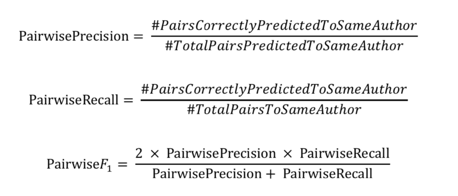

**数据集**

**任务1：论文的冷启动消歧（Name Disambiguation from Scratch - sna）**

**训练集**

**train_author.json**

数据格式：此文件中的数据组织成一个字典（dictionary，记为dic1），存储为JSON对象。 dic1的键（key）是作者姓名。 dic1的值（value）是表示同名作者集合的字典（记为dic2）。 dic2的键（key）是作者ID， dic2的值（value）是该作者的论文ID列表。

**train_pub.json****：此文件包含train_author.json所有论文的元数据，数据存储为JSON对象；

数据格式：此文件的数据表示为一个字典（dictionary），其键（key）是论文ID，其值是相应的论文信息。 每篇论文的数据格式如下：

| **域**       | **类型**        | **含义**  | **举例**                                                     |
| ------------ | --------------- | --------- | ------------------------------------------------------------ |
| id           | string          | 论文ID    | 53e9ab9eb7602d970354a97e                                     |
| title        | string          | 题目      | Data mining: concepts and techniques                         |
| authors.name | string          | 作者姓名  | Jiawei Han                                                   |
| author.org   | string          | 作者单位  | department of computer science university   of illinois at urbana champaign |
| venue        | string          | 会议/期刊 | Inteligencia Artificial, Revista   Iberoamericana de Inteligencia Artificial |
| year         | int             | 发表年份  | 2000                                                         |
| keywords     | list of strings | 关键词    | ["data mining",   "structured data", "world wide web", "social   network", "relational data"] |
| abstract     | string          | 摘要      | Our ability to generate...                                   |

 

 **验证集（9.30 比赛开始时公布）**

**sna_valid_author_raw.json**：二级字典，key值为作者姓名，value为一个论文的list，代表该作者姓名下所有同名作者的论文, 参赛者需要将同名作者的论文聚成不同的类簇。

**sna_valid_example_evaluation_scratch.json**：示例提交文件，组织成二级字典格式，key值为作者姓名， value值是一个二维列表，第一维的长度代表类簇的数目，第二维代表各个类簇的论文ids。

**sna_valid_pub.json**：二级字典，代表验证集所有论文的元信息，格式同train_pub.json。

**测试集（11月30日公布）**

**sna_test_author_raw.json**：二级字典，key值为作者姓名，value为一个论文的list，代表该作者姓名下所有同名作者的论文, 参赛者需要将同名作者的论文聚成不同的类簇。

**sna_test_example_evaluation_scratch.json**：示例提交文件，组织成二级字典格式，key值为作者姓名， value值是一个二维列表，第一维的长度代表类簇的数目，第二维代表各个类簇的论文ids。

**sna_test_pub.json**：二级字典，代表验证集所有论文的元信息，格式同train_pub.json。

 **评测方案**

**任务描述：**给定一堆拥有同名作者的论文，要求返回一组论文聚类，使得一个聚类内部的论文都是一个人的，不同聚类间的论文不属于一个人。最终目的是识别出哪些同名作者的论文属于同一个人。 

**评测方法：**使用Macro Pairwise-F1作为模型评估度量。

**时间表**

9月 30 日 ：比赛正式开始，开放比赛队伍注册，同步发布训练集和验证集。 

9 月 30 日 ：开放验证集提交答案入口。 

11 月 25 日（23:59pm UTC）：组队截止（请注意，组队时所有队员的提交次数之和不能超过组队日的单支队伍理论提交总数，所以请尽早组队）。 

11 月 30 日（23:59pm UTC）：测试集开放下载，选手有48小时时间下载数据并提交测试集结果。 

12 月 2 日（23:59pm UTC）：比赛截止，计算排名，前十名的队伍需要提交比赛报告。

 

